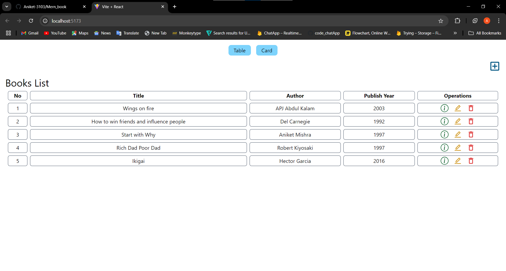
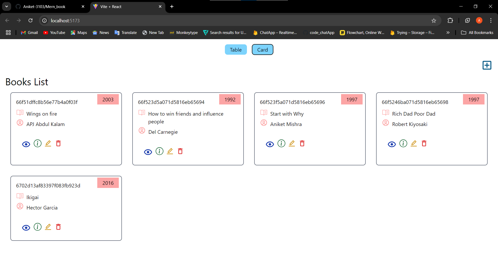
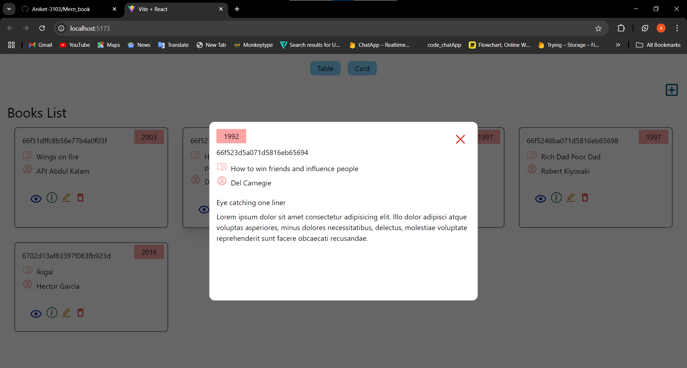
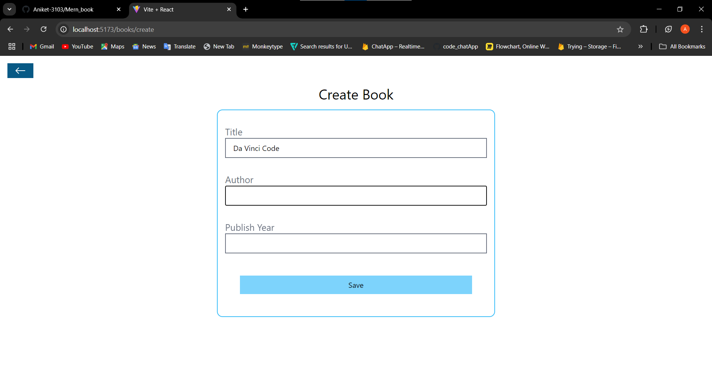
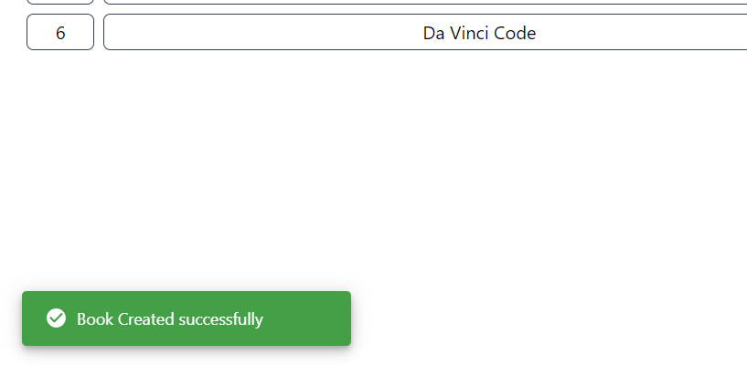
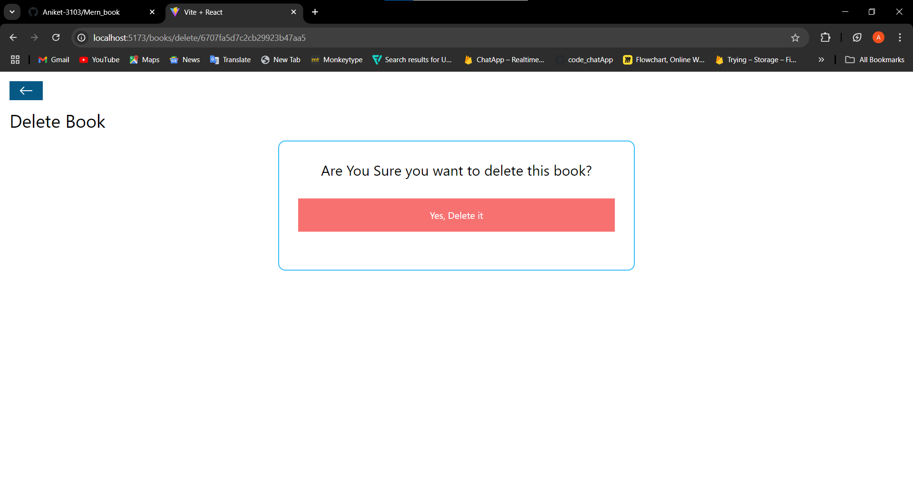
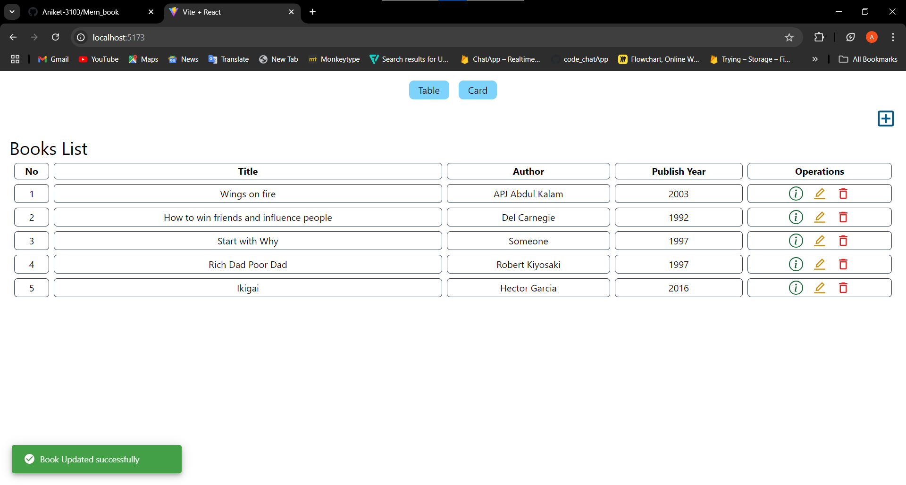
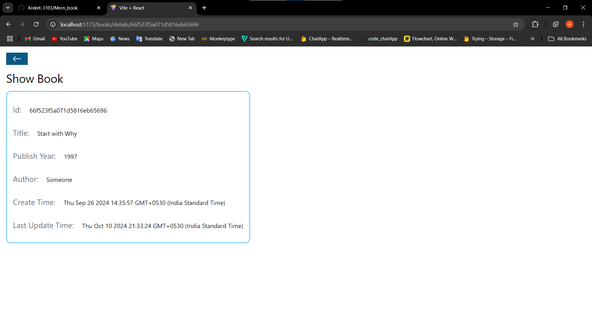

# MERN Book Management Application

This is a simple MERN (MongoDB, Express, React, Node.js) application that allows users to perform basic CRUD (Create, Read, Update, Delete) operations on a list of books. The application provides two ways to view the list of books: a table view and a card view. Users can toggle between these views using buttons on the home page.

## Features

- **Add Books**: Users can add new books by providing details like title, author, and publishYear.
- **View Books**: Books can be viewed in either a card view or a table view, depending on the user's choice.
- **Edit Books**: Users can update book information.
- **Delete Books**: Books can be removed from the list.
- **Toggle Views**: The home page features two buttons, "Table" and "Card," which allow users to switch between table view and card view.

## Technologies Used

- **Frontend**: React.js
- **Backend**: Node.js with Express.js
- **Database**: MongoDB
- **Styling**: Tailwind CSS

## Getting Started

To get a local copy of the project up and running, follow these simple steps.

### Installation

1. Clone the repository:

   ```bash
   git clone https://github.com/Aniket-3103/Mern_book.git
   ```


2. Install dependencies for both the backend and frontend:

   **For Backend** (inside the root directory):
   ```
   cd backend
   npm install
   ```

   **For Frontend** (inside the root directory):
   ```
   cd frontend
   npm install
   ```


### Running the Application

1. Start the backend server:

   ```
   cd backend
   nodemon index.js
   ```

   The backend will be running at `http://localhost:3000`.

2. Start the frontend application:

   ```
   cd frontend
   npm run dev
   ```

   The frontend will be running at `http://localhost:5173`.


#### Screenshots:

Home (Table View):


Home (Card View):




Adding a book:


New book has been added and a success alert has been generated.


Deleting a book:


Editing a book:


Author name has been changed here


Showing a particular book to the user:
